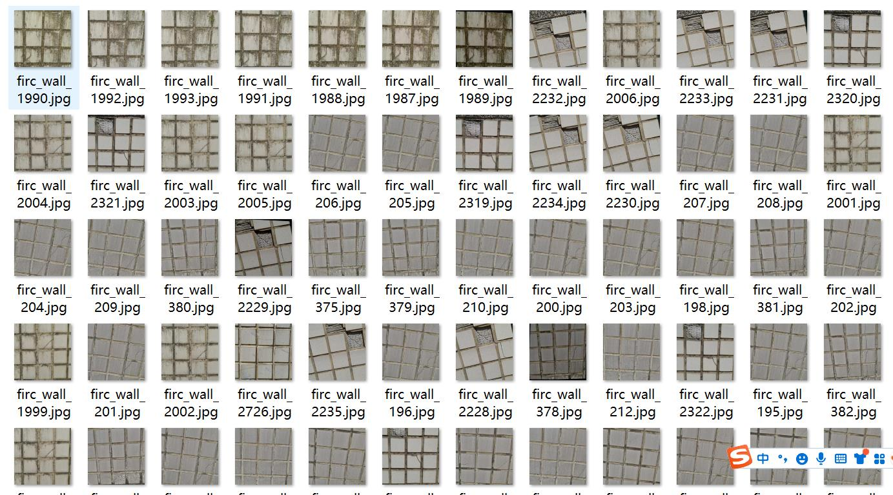
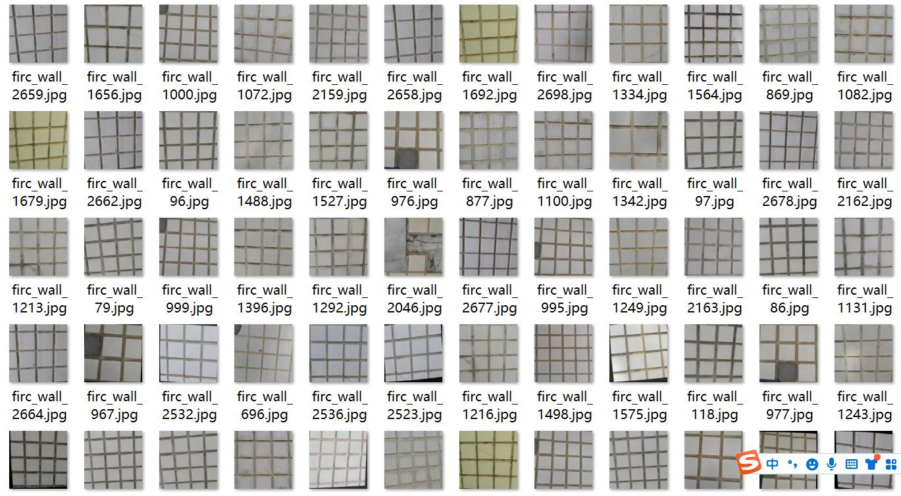
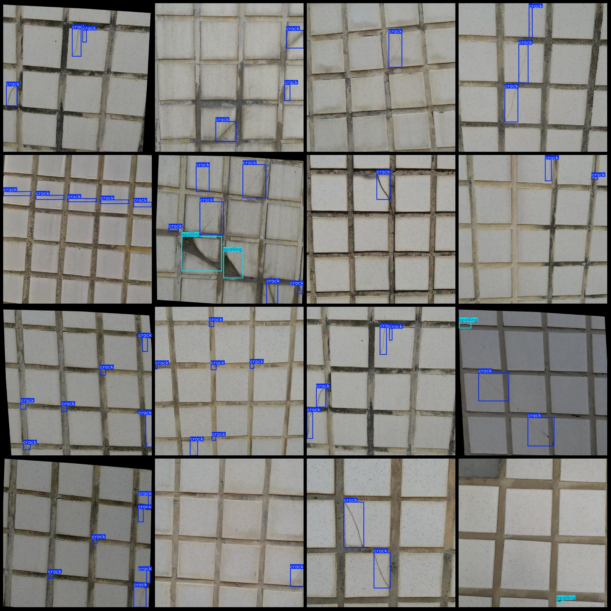

# Wall Tile Crack, Exfoliation, and Scaling Defect Detection Dataset (VOC+YOLO format) - 2936 Images in 3 Categories

Note: There are a small number of augmented images in the dataset, primarily rotation augmented images.

Dataset Format: Pascal VOC format + YOLO format (without split path in the txt file, only contain jpg images as well as corresponding VOC format xml files and YOLO format txt files)

Number of Images (Total jpg files): 2936
Number of Annotations (Total xml files): 2936
Number of Annotations (Total txt files): 2936
Number of Annotation Categories: 3
Repository: firc-dataset
Annotation Category Names (Note that the order of categories in the YOLO format may not match this, but refer to the labels folder "classes.txt" for accuracy): ["crack", "exfoliation", "spalling"]
Number of Boxes per Category:
- Crack (Cracks) = 9283
- Exfoliation (Exfoliation) = 299
- Scaling (Scaling) = 466
Total Boxes: 10048
Image Resolution: 640x640
Annotation Tool Used: labelImg
Annotation Rules: Drawing bounding boxes for each category
Important Notice: No specific statement is provided at the moment
Special Note: This dataset does not guarantee the accuracy of trained models or weight files

Example Annotation:

## Images

Here is a pay link on Stripe ( https://buy.stripe.com/3cs8yP7sY87d0vu9AB ). Please contact me lonlonago@foxmail.com after funding $89, and I will send you a complete data files , thank you!

